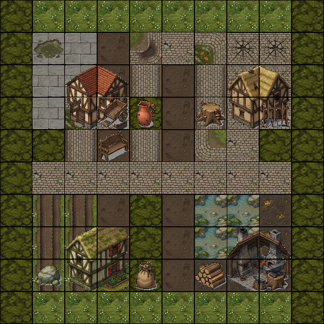

# Examples Gallery

Pre-generated examples showing what Generative Town can create.

## Enchanted Forest

*Theme: "enchanted forest"*


A mystical woodland with glowing paths and magical atmosphere.

[View full output](enchanted-forest/)

---

## Medieval Village

*Theme: "medieval village"*



A classic fantasy village with cobblestone streets and rustic buildings.

[View full output](medieval-village/)

---

## Cyberpunk City

*Theme: "cyberpunk city"*


Neon-lit urban streets with futuristic architecture.

[View full output](cyberpunk-city/)

---

## Generate Your Own

```bash
pnpm design "your theme here"
pnpm plan
```

Outputs will be saved to `src/agent/output/`.
